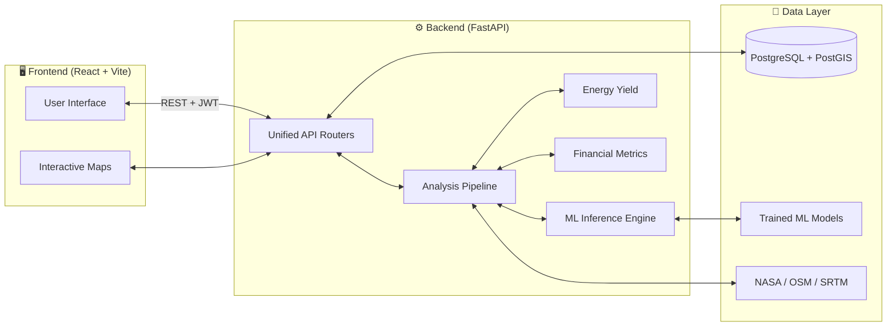

<div align="center">
  

  <h1>☀️🌬️ Solar & Wind Deployment Intelligence Platform</h1>

  <p>
    <strong>An AI-powered spatial analytics platform for evaluating, scoring, and forecasting renewable energy deployment sites — anywhere on Earth.</strong>
  </p>

  <p>
    <a href="https://www.python.org"></a>
    <a href="https://fastapi.tiangolo.com"></a>
    <a href="https://reactjs.org/"></a>
    <a href="https://www.postgresql.org/"></a>
    <a href="https://opensource.org/licenses/MIT"></a>
  </p>

  <p>
    <a href="#-overview">Overview</a> •
    <a href="#-key-features">Features</a> •
    <a href="#-architecture">Architecture</a> •
    <a href="#-quick-start">Quick Start</a> •
    <a href="#-api-reference">API</a>
  </p>
</div>

---

## 📖 Overview

The **Solar & Wind Deployment Intelligence Platform** is a production-ready, full-stack enterprise application designed to empower renewable energy analysts, investors, and engineers. It evaluates the feasibility of deploying solar and wind energy farms at any geographic coordinate in minutes rather than weeks.

By combining a **Random Forest ML model (R² = 0.89)** with live geospatial data pipelines (NASA POWER, Global Wind Atlas, OpenStreetMap, SRTM), the platform generates comprehensive suitability scores, 12-month energy forecasts, and detailed financial models (CAPEX, OPEX, LCOE, ROI, Payback Period), drastically reducing the time required for preliminary site analysis.

---

## ✨ Key Features

- 🌍 **Geospatial Data Integration:** Auto-fetches and processes data from NASA POWER, Global Wind Atlas, OpenStreetMap, and SRTM elevation models.
- 🧠 **ML Suitability Scoring:** Random Forest Regressor predicts site viability based on irradiance, wind speed, elevation, slope, and grid proximity constraints.
- ⚡ **Energy Yield Forecasting:** Calculates estimated monthly and annual energy yield forecasts tailored for Solar, Wind, or Hybrid deployment strategies.
- 💰 **Financial Analysis:** Automatically estimates Initial Capital Cost (CAPEX), Revenue, Payback Period, ROI, and LCOE per kWh.
- 🗺️ **Interactive Geographic Dashboard:** Premium React UI featuring Leaflet interactive maps, dynamic state handling, Recharts visualizations, and a unified analysis report.
- 🔐 **JWT Authentication:** Secure login flow with role-based access control (Admin, Analyst, User).
- 🧪 **Comprehensive QA:** A robust 164-test Pytest suite covering all critical pipelines, ML models, and API endpoints.

---

## 🛠️ Tech Stack

### Backend
- **Core:** Python 3.11+, FastAPI, Uvicorn
- **Machine Learning & Geospatial:** Scikit-learn, Pandas, GeoPandas, Rasterio, Shapely, NumPy
- **Database ORM:** SQLAlchemy 2.0, Alembic (migrations)
- **Security:** JWT (python-jose), passlib (bcrypt)

### Frontend
- **Core:** React 18, Vite 5, React Router DOM v6
- **UI Components:** Leaflet, React-Leaflet, Recharts, Lucide React
- **Network:** Axios

### Infrastructure
- **Database Engine:** PostgreSQL 15, PostGIS 3.3
- **Database Management (GUI):** pgAdmin 4 (recommended for visually managing the database)
- **Containerization:** Docker, Docker Compose

---

## 📐 Architecture



---

## 🚀 Quick Start

### 1. Prerequisites
- **Python 3.11+**
- **Node.js 18+**
- **Docker Desktop** (For PostgreSQL Database container)
- **pgAdmin 4** (Optional: Recommended GUI for managing the PostgreSQL database)

### 2. Database Setup
Start a PostgreSQL + PostGIS instance using Docker Compose:
```bash
cd solar-wind-deployment-intelligence
docker-compose up -d
```
*This spins up a `solar_wind_db` database on port 5432.*

### 3. Backend Setup
Open a terminal, navigate into the backend, and start the virtual environment:
```bash
cd solar-wind-deployment-intelligence/backend
python -m venv venv
venv\Scripts\activate   # (Windows)
source venv/bin/activate # (Linux/macOS)
```
Install dependencies and set up the environment:
```bash
pip install -r requirements.txt
cp .env.example .env    # Configure your database credentials here
alembic upgrade head    # Run database migrations
```
Start the FastAPI server:
```bash
uvicorn app.main:app --reload --port 8000
```
> 🔗 **Swagger API Docs:** [http://localhost:8000/docs](http://localhost:8000/docs)

### 4. Frontend Setup
Open a **new terminal**, navigate to the frontend folder, and start Vite:
```bash
cd solar-wind-deployment-intelligence/frontend
npm install
npm run dev
```
> 🔗 **Application:** [http://localhost:5173](http://localhost:5173)

### 5. Login
To access the platform immediately, a seed test user is available:
- **Email:** `user@gmail.com`
- **Password:** `123456`

---

## 📡 Core API Reference

All backend endpoints are prefixed with `/api/v1/`.

| Method | Endpoint | Description | Auth |
|---|---|---|---|
| `POST` | `/auth/login` | Authenticate and receive a JWT token | ❌ |
| `POST` | `/auth/register` | Register a new user account | ❌ |
| `POST` | `/analysis/` | Run the full End-to-End unified analysis pipeline (ML, Energy, Finance) | ✅ |
| `GET` | `/projects/` | Retrieve all saved deployment projects for the user | ✅ |

*Full interactive documentation is available at `/docs` when the backend server is running.*

---

## 🤝 Contributing

Contributions, bug reports, and feature requests are welcome!
1. Fork the repository
2. Create a feature branch: `git checkout -b feature/my-new-feature`
3. Commit your changes: `git commit -m 'feat: add my new feature'`
4. Push to the branch: `git push origin feature/my-new-feature`
5. Open a Pull Request

Please read `CONTRIBUTING.md` for full guidelines on code style, testing requirements, and the PR process.

---

## 🙏 Acknowledgements

Developed by **Smita Mhatugade** as part of the **Infosys Springboard Virtual Internship Program**.

**Data Sources & Integrations:**
- [NASA POWER](https://power.larc.nasa.gov/) — Solar irradiance & meteorological data
- [Global Wind Atlas](https://globalwindatlas.info/) — Wind speed resource data
- [OpenStreetMap](https://www.openstreetmap.org/) — Infrastructure & land-use data
- [SRTM](https://www2.jpl.nasa.gov/srtm/) — Shuttle Radar Topography Mission elevation models

---

<div align="center">
  <sub>Built with ❤️ for a cleaner, renewable energy future.</sub>
</div>
