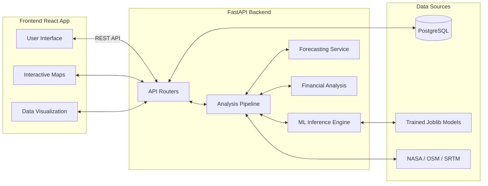

# ☀️🌬️ Solar & Wind Deployment Intelligence Platform

> **An AI-powered spatial analytics platform for evaluating, scoring, and forecasting renewable energy deployment sites.**

[](https://www.python.org)
[](https://fastapi.tiangolo.com)
[](https://reactjs.org/)
[](https://www.postgresql.org/)
[](https://opensource.org/licenses/MIT)

## 📖 Overview

The **Solar & Wind Deployment Intelligence Platform** is a full-stack application designed to help renewable energy analysts, investors, and engineers evaluate the feasibility of deploying solar and wind energy farms at any given geographic coordinate. 

By combining machine learning (Random Forest Regressors) with real-world geospatial data (NASA POWER, Global Wind Atlas, OSM, SRTM), the platform generates comprehensive suitability scores, energy forecasts, and financial estimates, drastically reducing the time required for preliminary site analysis.

## ✨ Key Features

- **🌍 Geospatial Data Integration:** Automatically fetches and processes data from NASA POWER, Global Wind Atlas, OpenStreetMap, and SRTM elevation models.
- **🧠 Machine Learning Scoring:** Utilizes a trained Random Forest model (R²=0.89) to score site suitability based on irradiance, wind speed, elevation, slope, and proximity to infrastructure.
- **⚡ Yield Forecasting:** Generates monthly energy yield forecasts for Solar, Wind, or Hybrid deployment strategies based on capacity factors and historical time-series data.
- **💰 Financial Analysis:** Estimates CAPEX, OPEX, expected revenue, Payback Period, ROI, and LCOE (Levelized Cost of Energy) for the recommended deployment type.
- **🗺️ Interactive Dashboard:** A modern React/Vite frontend featuring interactive maps (Leaflet), elevation profiles, monthly yield charts, and a saved projects tracker.
- **🔐 Secure Authentication:** JWT-based authentication with role-based access control (Admin, Analyst, User).

## 🛠️ Tech Stack

| Layer | Technologies |
|---|---|
| **Frontend** | React 18, Vite, React Router, Recharts, Leaflet, Tailwind CSS / Vanilla CSS |
| **Backend** | Python, FastAPI, SQLAlchemy (ORM), Pydantic, Scikit-learn, Pandas, GeoPandas |
| **Database** | PostgreSQL + PostGIS, Alembic (Migrations) |
| **Infrastructure** | Docker, Docker Compose |

## 📐 Architecture



## 📂 Project Structure

```text
solar-wind-deployment-intelligence/
├── backend/                  # FastAPI Application
│   ├── app/                  # Application code
│   │   ├── api/              # API Endpoints (Auth, Analysis, Projects, etc.)
│   │   ├── auth/             # JWT Authentication & Roles
│   │   ├── data_sources/     # Integrations (NASA, OSM, SRTM, Wind Atlas)
│   │   ├── database/         # SQLAlchemy connection & sessions
│   │   ├── evaluation/       # Scoring & Recommendation logic
│   │   ├── models/           # SQLAlchemy ORM Models
│   │   ├── schemas/          # Pydantic schemas (Validation)
│   │   └── services/         # Core business logic (ML, Forecasting, Finance, Pipeline)
│   ├── models/               # Trained ML models (.joblib)
│   ├── tests/                # Pytest suite
│   ├── Dockerfile            # Backend Docker configuration
│   └── requirements.txt      # Python dependencies
├── frontend/                 # React Application (Vite)
│   ├── src/
│   │   ├── api/              # Axios API clients
│   │   ├── components/       # Reusable UI components (Charts, Maps, Tables)
│   │   ├── pages/            # Page layouts (Dashboard, SiteAnalysis, Reports)
│   │   └── services/         # Frontend services
│   ├── package.json          # Node dependencies
│   └── vite.config.js        # Vite configuration
├── datasets/                 # Local caching for geospatial data
├── docs/                     # Project documentation & reports
├── docker-compose.yml        # Docker composition for database
└── README.md                 # This file
```

## 🚀 Getting Started

### Prerequisites
- Python 3.11+
- Node.js 18+
- PostgreSQL 15+ (or use the provided Docker Compose)
- Git

### 1. Database Setup (Docker)
Start the PostgreSQL/PostGIS database using Docker Compose:
```bash
docker-compose up -d
```

### 2. Backend Setup
Navigate to the backend directory, set up a virtual environment, and install dependencies:
```bash
cd backend
python -m venv venv
# Activate virtual environment (Windows)
venv\Scripts\activate
# Activate virtual environment (Linux/Mac)
# source venv/bin/activate

pip install -r requirements.txt
```

Create a `.env` file in the `backend` directory (you can copy `.env.example`):
```bash
cp .env.example .env
# Edit .env to add your actual database credentials and JWT secret
```

Run the FastAPI server:
```bash
uvicorn app.main:app --reload --port 8000
```
The API documentation will be available at `http://localhost:8000/docs`.

### 3. Frontend Setup
Open a new terminal, navigate to the frontend directory, and install dependencies:
```bash
cd frontend
npm install
```

Start the Vite development server:
```bash
npm run dev
```
The application will be available at `http://localhost:5173`.

## 📡 API Endpoints Summary

The backend exposes a comprehensive RESTful API. Key endpoints include:

| Category | Endpoint | Method | Description |
|---|---|---|---|
| **Auth** | `/api/v1/auth/register` | POST | Register a new user |
| **Auth** | `/api/v1/auth/login` | POST | Authenticate & get JWT |
| **Analysis** | `/api/v1/analysis/` | POST | Run full site suitability pipeline |
| **Analysis** | `/api/v1/analysis/history` | GET | Get past analyses for user |
| **Projects** | `/api/v1/projects/` | GET/POST | Manage saved deployment projects |
| **Reports** | `/api/v1/reports/generate` | POST | Generate PDF/Excel reports |

## 🤖 Machine Learning Model

The platform uses a **Random Forest Regressor** to predict site suitability.

- **Baseline Metrics:** MAE ~4.5, RMSE ~6.2, R² ~0.89.
- **Top Features:** Solar Irradiance, Wind Speed, Distance to Grid, Slope.
- **Location:** The trained model is saved at `backend/models/best_baseline_model.joblib`.
- **Documentation:** See `docs/model_behaviour.md` for detailed technical notes.

## 🧪 Testing

The backend includes a comprehensive pytest suite (164 tests). To run them:
```bash
cd backend
# Ensure virtual environment is active
pytest
```

## 🤝 Contributing

Contributions are welcome! Please refer to the [CONTRIBUTING.md](CONTRIBUTING.md) file for guidelines on how to make changes, run tests, and submit pull requests.

## 📄 License

This project is licensed under the MIT License - see the [LICENSE](LICENSE) file for details.

## 🙏 Acknowledgements

Developed by **Smita Mhatugade** as part of the Infosys Virtual Internship / Springboard program.
